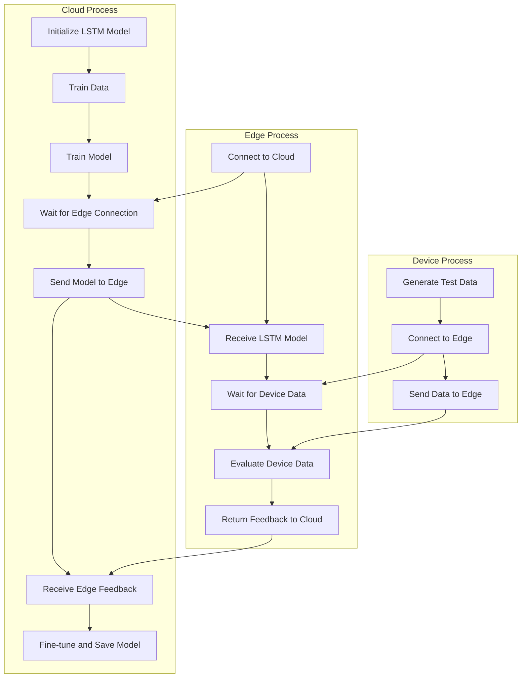

# LSTMProject

[](https://www.python.org/)
[](#)
[](#)

## Overview

**English.** LSTMProject is a research-oriented Python project for sequence-model-based device behavior modeling and identity authentication. It uses LSTM networks to learn mobility and power-consumption patterns from simulated autonomous devices, including ground vehicles, forklifts, and UAVs. The system combines trajectory prediction and state classification to distinguish legitimate devices from abnormal or spoofed devices.

The repository is structured as an end-to-end experimental prototype: synthetic data generation, device fingerprint construction, LSTM training/testing, transfer learning across device types, cloud-edge-device collaborative validation, and result visualization. It is designed for researchers and engineers who need a controllable environment for studying intelligent device authentication under dynamic cyber-physical behavior.

**中文。** LSTMProject 是一个面向研究的 Python 项目，用于基于序列模型的设备行为建模与身份认证。项目使用 LSTM 网络学习无人车、智能叉车和无人机等设备的运动轨迹与电量消耗模式，并结合轨迹预测和状态分类来区分真实设备、异常设备和伪造设备。

本仓库覆盖完整实验链路：合成数据生成、设备指纹构造、LSTM 训练与测试、跨设备类型迁移学习、云-边-端协同验证，以及结果可视化。它适合用于研究动态物理行为驱动的智能设备认证、异常状态识别和云边协同安全验证。

## Core Idea

**English.** The authentication logic uses two complementary signals:

1. **Prediction consistency**: historical device states are used to predict the next state, including spatial position and power level.
2. **State classification**: device behavior is classified into operational states with one-hot labels.

A device is considered more trustworthy when its predicted trajectory, power evolution, state label, and device fingerprint are mutually consistent.

**中文。** 项目的认证逻辑由两个互补信号共同决定：

1. **预测一致性**：利用历史设备状态预测下一时刻的位置与电量。
2. **状态分类**：将设备行为映射到 one-hot 编码的运行状态。

当设备的轨迹预测、电量变化、状态标签和设备指纹彼此一致时，该设备更可能是真实可信设备。

## Behavior States

The project models five device states:

| State | 中文状态 | One-hot Label | Description |
| --- | --- | --- | --- |
| Running | 运行 | `10000` | Device moves according to its planned route. |
| Waiting | 待料 | `01000` | Device pauses temporarily and resumes operation later. |
| Stored | 封存 | `00100` | Device remains fixed at its initial state. |
| Maintenance | 检修 | `00010` | Device stops after moving to an intermediate position. |
| Out of Power | 没电 | `00001` | Device stops after battery depletion. |

**Positive samples / 正样本:** running and waiting states.

**Negative samples / 负样本:** stored, maintenance, and out-of-power states.

## What Is Implemented

**English.**

- Synthetic behavior generation for cars, forklifts, and UAVs.
- Four-dimensional dynamic input: `X`, `Y`, `Z`, and `Power`.
- LSTM-based trajectory and power prediction.
- Device-state classification with one-hot labels.
- Static and dynamic device attributes for device fingerprinting.
- RSA key-pair generation associated with device identity.
- Transfer learning from car behavior models to forklift and UAV scenarios.
- Cloud-edge-device socket workflow for collaborative model validation.
- Visualization scripts for routes, timing, accuracy, and transfer-learning results.

**中文。**

- 支持无人车、智能叉车、无人机的合成行为数据生成。
- 使用四维动态输入：`X`、`Y`、`Z`、`Power`。
- 基于 LSTM 的轨迹与电量预测。
- 基于 one-hot 标签的设备状态分类。
- 结合静态属性与动态属性生成设备指纹。
- 与设备身份关联的 RSA 公私钥生成。
- 支持从无人车模型迁移到叉车和无人机任务。
- 支持云-边-端 socket 协同验证流程。
- 提供路线、时间、准确率和迁移学习结果的可视化脚本。

## Repository Structure

```text
Dataset.py                         # Synthetic data generation for cars, forklifts, and UAVs
Model.py                           # LSTM model definition
route.py                           # Route design and route visualization
run.py                             # Main execution entry for selected workflows
train_test_model.py                # LSTM training and testing on vehicle data
transfer_learning.py               # Transfer learning across device types
transfer_learning_car.py           # Car-specific transfer-learning workflow
transferlearning_time_forklift.py  # Forklift timing experiment
cloud_edge_client.py               # Cloud-edge-device collaborative socket workflow
device.py                          # Device attributes, fingerprints, and RSA key pairs
devicefinger_test.py               # Device fingerprint verification experiments
plot_average_acc.py                # Accuracy visualization
plot_time.py                       # Timing visualization
plot_transferlearning.py           # Transfer-learning visualization
Dataset/                           # Generated or stored datasets
Model/                             # Saved model artifacts
results/                           # Route figures and experiment outputs
package/                           # Packaged prediction/classification interface
key_pair/                          # Generated key material
```

## Data Generation

**English.** `Dataset.py` generates controlled behavior traces for three device classes:

- **Car / 无人车**: ground movement with `Z = 0`.
- **Forklift / 智能叉车**: ground logistics movement with `Z = 0`.
- **UAV / 无人机**: aerial movement with non-zero `Z` dynamics.

Each sample contains position, power, behavior state, and device-related information. The default modeling input is four-dimensional: `X`, `Y`, `Z`, and `Power`.

**中文。** `Dataset.py` 用于生成三类设备的可控行为轨迹：

- **无人车**：地面运动，`Z = 0`。
- **智能叉车**：地面物流运动，`Z = 0`。
- **无人机**：空中运动，包含非零 `Z` 轴变化。

每个样本包含位置、电量、行为状态和设备相关信息。默认模型输入为四维：`X`、`Y`、`Z`、`Power`。

## Model Design

**English.** The LSTM model learns temporal dependencies from device behavior sequences. Given a sequence of historical observations at times `t1, t2, ..., tn-1`, the model predicts the device state at `tn` and supports downstream authentication through prediction error and classification output.

**中文。** LSTM 模型用于学习设备行为序列中的时间依赖关系。给定 `t1, t2, ..., tn-1` 时刻的历史观测，模型预测 `tn` 时刻的设备状态，并通过预测误差和分类输出支持后续身份认证。

Relevant files:

- `Model.py`
- `train_test_model.py`
- `package/pred_classs.py`

## Device Fingerprint and Identity Layer

**English.** `device.py` constructs device identities from static attributes, dynamic attributes, device fingerprints, and RSA key pairs.

Static attributes include device ID, name, manufacturer, device type, OS information, hostname, IP address, and MAC address. Dynamic attributes include position, speed, power, route ID, permissions, and update frequency.

**中文。** `device.py` 基于静态属性、动态属性、设备指纹和 RSA 公私钥构造设备身份。

静态属性包括设备 ID、名称、制造商、设备类型、操作系统信息、主机名、IP 地址和 MAC 地址。动态属性包括位置、速度、电量、路线编号、权限和数据更新频率。

## Transfer Learning

**English.** The transfer-learning workflow studies whether behavior knowledge learned from one device class can generalize to another. A typical experiment first trains an LSTM model on car data, evaluates it on forklift or UAV behavior, and then fine-tunes the model with a small amount of target-device data.

**中文。** 迁移学习流程用于研究一种设备类型上学到的行为知识能否迁移到另一种设备类型。典型实验流程是先在无人车数据上训练 LSTM，然后直接测试叉车或无人机行为，再使用少量目标设备数据进行微调。

Main steps:

1. Generate training, testing, and fine-tuning datasets for forklifts and UAVs.
2. Train target-device models from scratch.
3. Test car-trained models directly on forklifts and UAVs.
4. Fine-tune car-trained models for target-device authentication.

## Cloud-Edge-Device Workflow

**English.** `cloud_edge_client.py` simulates a collaborative workflow among cloud, edge, and device processes using socket communication.

- **Cloud process**: initializes, trains, fine-tunes, and distributes the LSTM model.
- **Edge process**: receives the model, evaluates device data, and sends feedback to the cloud.
- **Device process**: generates test behavior data and transmits it to the edge side.

**中文。** `cloud_edge_client.py` 使用 socket 通信模拟云端、边端和设备端的协同验证流程。

- **云端进程**：负责模型初始化、训练、微调和模型下发。
- **边端进程**：接收模型，测试设备数据，并将反馈发送回云端。
- **设备进程**：生成测试行为数据，并发送给边端进行验证。


```mermaid
graph TD
    subgraph Cloud[Cloud Process]
    A1[Initialize LSTM Model] --> A2[Train Data]
    A2 --> A3[Train Model]
    A3 --> A4[Wait for Edge Connection]
    A4 --> A5[Send Model to Edge]
    A5 --> A6[Receive Edge Feedback]
    A6 --> A7[Fine-tune and Save Model]
    end

    subgraph Edge[Edge Process]
    B1[Connect to Cloud] --> B2[Receive LSTM Model]
    B2 --> B3[Wait for Device Data]
    B3 --> B4[Evaluate Device Data]
    B4 --> B5[Return Feedback to Cloud]
    end

    subgraph Device[Device Process]
    C1[Generate Test Data] --> C2[Connect to Edge]
    C2 --> C3[Send Data to Edge]
    end

    B1 --> A4
    A5 --> B2
    C2 --> B3
    C3 --> B4
    B5 --> A6
```

## Typical Usage

**English.** The repository contains multiple experiment scripts. Select the entry according to the experiment you want to run.

**中文。** 仓库包含多个实验脚本，可根据实验目标选择入口。

```bash
# Train and test the LSTM model
python train_test_model.py

# Run transfer-learning experiments
python transfer_learning.py

# Run cloud-edge-device collaborative workflow
python cloud_edge_client.py

# Visualize transfer-learning results
python plot_transferlearning.py
```

## Notes on Reproducibility

**English.** This project is a research prototype. For rigorous comparison, keep the generated dataset, random seed, model checkpoint, and evaluation script fixed across runs. Generated datasets and trained models should be versioned or archived when reporting results.

**中文。** 本项目是研究原型。进行严谨对比时，应固定生成数据、随机种子、模型 checkpoint 和评估脚本。报告实验结果时，建议归档对应的数据集与模型文件。

## Suggested Applications

**English.**

- Behavior-aware device authentication.
- Industrial IoT identity verification.
- Autonomous vehicle anomaly detection.
- Cloud-edge collaborative model validation.
- Transfer learning for heterogeneous cyber-physical devices.

**中文。**

- 行为感知设备身份认证。
- 工业物联网身份验证。
- 自动化设备异常检测。
- 云边协同模型验证。
- 异构 cyber-physical 设备迁移学习。
